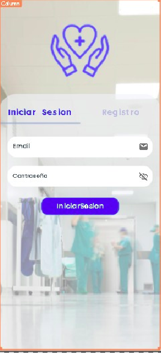

# MedicalApp

  

  
  

MedicalApp es un sistema de administración de centros de salud pensada y diseñada para pacientes y doctores.

Bajo con la mano de Redes de Valor y Github Camp, logramos de poder desarrollar una solucion importante para el area de Salud, Tecnologia e Innovacion.

  
  

